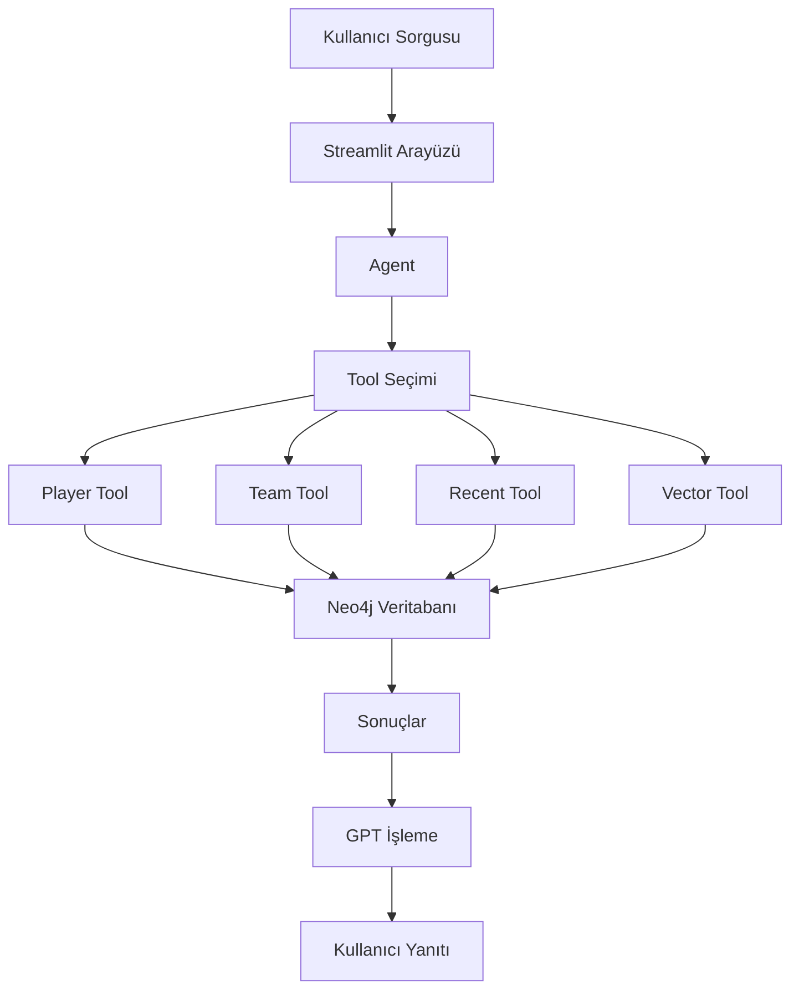

# Hoops: The Courtside Bot 🏀

## Proje Genel Bakış

Hoops: The Courtside Bot, basketbol maçları ve istatistikleri hakkında bilgi sağlayan, yapay zeka destekli bir sohbet botudur. Neo4j grafik veritabanı ve OpenAI'nin GPT modellerini kullanarak, kullanıcılara basketbol dünyası hakkında detaylı ve doğru bilgiler sunar.


### Sistem Akış Şeması



## Kurulum

1. Projeyi klonlayın:
```bash
git clone https://github.com/onuralpArsln/HoopsTheCourtsideBot.git
cd HoopsTheCourtsideBot
```

2. Gerekli paketleri yükleyin:
```bash
pip install -r requirements.txt
```

3. Gerekli API anahtarlarını ve kimlik bilgilerini ayarlayın:

`.env` dosyası oluşturun ve aşağıdaki bilgileri ekleyin:
```
NEO4J_URI=your_neo4j_uri
NEO4J_USERNAME=your_username
NEO4J_PASSWORD=your_password
OPENAI_API_KEY=your_openai_api_key
```

`.streamlit/secrets.toml` dosyası oluşturun:
```toml
[neo4j]
uri = "your_neo4j_uri"
username = "your_username"
password = "your_password"

[openai]
api_key = "your_openai_api_key"
```

## Veritabanı Yapısı

Proje, Neo4j grafik veritabanında aşağıdaki yapıyı kullanır:

### Düğümler (Nodes)
- **Team**: Takım bilgileri
  - Özellikler: id, name
- **Player**: Oyuncu bilgileri
  - Özellikler: id, name
- **Match**: Maç bilgileri
  - Özellikler: id, date, team1_score, team2_score, winner_team_id, summary, summary_embedding

### İlişkiler (Relationships)
- `(Player)-[:PLAYS_FOR]->(Team)`: Oyuncunun takımı
- `(Team)-[:PLAYED]->(Match)`: Takımın oynadığı maç
- `(Team)-[:WON]->(Match)`: Maçı kazanan takım
- `(Team)-[:LOST]->(Match)`: Maçı kaybeden takım
- `(Player)-[:SCORED]->(Match)`: Oyuncunun maçtaki sayıları

## Proje Yapısı

```
HoopsTheCourtsideBot/
├── agent.py           # Ana agent yapısı
├── bot.py            # Bot ana uygulaması
├── graph.py          # Neo4j bağlantı yönetimi
├── llm.py            # LLM entegrasyonu
├── matchSumEmbGen.py # Maç özeti embedding oluşturucu
├── tools/            # Bot araçları
│   ├── player.py     # Oyuncu sorgulama aracı
│   ├── team.py       # Takım sorgulama aracı
│   ├── recent.py     # Son maçlar aracı
│   ├── cypher.py     # Cypher sorgu aracı
│   └── vector.py     # Vektör arama aracı
├── data/             # Veri dosyaları
│   ├── teams.csv
│   ├── players.csv
│   ├── matches.csv
│   ├── player_scores.csv
│   └── match_summaries.csv
└── .streamlit/       # Streamlit yapılandırması
```

## Araçlar (Tools)

### 1. Player Tool
- Oyuncular hakkında detaylı bilgi sağlar
- Oyuncu istatistiklerini ve performans verilerini sorgular
- Takım bilgilerini ve maç geçmişini gösterir

### 2. Team Tool
- Takım istatistiklerini ve performans verilerini sunar
- Takımın oyuncularını listeler
- Maç geçmişi ve sonuçlarını gösterir

### 3. Recent Tool
- Son oynanan maçların özetlerini sunar
- Maç sonuçlarını ve önemli olayları listeler
- Oyuncu performanslarını gösterir

### 4. Vector Tool
- Maç özetlerinde semantik arama yapar
- Benzer maçları bulur
- Özel sorgulara göre maç analizi yapar

### 5. Cypher Tool
- Özel Neo4j Cypher sorguları çalıştırır
- Karmaşık veri analizleri yapar
- Özelleştirilmiş raporlar oluşturur

## Kullanım

Botu başlatmak için:
```bash
streamlit run bot.py
```

## Katkıda Bulunma

1. Bu depoyu fork edin
2. Yeni bir branch oluşturun (`git checkout -b feature/amazing-feature`)
3. Değişikliklerinizi commit edin (`git commit -m 'Add some amazing feature'`)
4. Branch'inizi push edin (`git push origin feature/amazing-feature`)
5. Bir Pull Request oluşturun

## Lisans

Bu proje MIT lisansı altında lisanslanmıştır. Detaylar için `LICENSE` dosyasına bakın.